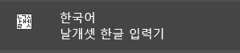
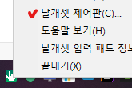
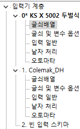
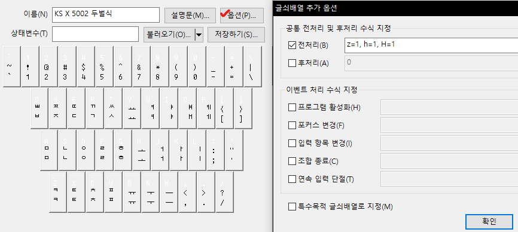
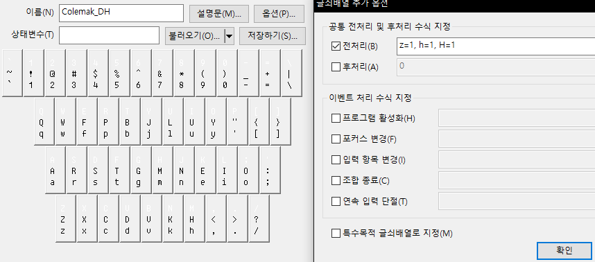
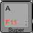

# CRKBD 3x6 Custom keymap for Korean

Refer to Miryoku Layout (COLEMAK-DH)  
  

BASE Layer


[home_row_mods_tutorial](https://precondition.github.io/home-row-mods)  
Home Row Mod : `GCAS`
```c
/* QWERTY_SET2 */
// Left-hand home row mods
#define S_HOME_A LGUI_T(KC_A)
#define S_HOME_S LCTL_T(KC_S)
#define S_HOME_D LALT_T(KC_D)
#define S_HOME_F LSFT_T(KC_F)

// Right-hand home row mods
#define S_HOME_J RSFT_T(KC_J)
#define S_HOME_K LALT_T(KC_K)
#define S_HOME_L RCTL_T(KC_L)
#define S_HOME_SCLN RGUI_T(KC_SCLN)

/* LT KEYS */
// Layer-tab key mods
#define MEDIA_ESC LT(_MEDIA,KC_ESC)
#define NAV_SPC LT(_NAV,KC_SPC)
#define MOUSE_TAB LT(_MOUSE,KC_TAB)
#define SYM_ENT LT(_SYM,KC_ENT)
#define NUM_BSPC LT(_NUM,KC_BSPC)
#define FUN_DEL LT(_FUN,KC_DEL)
```

Make example for this keyboard (after setting up your build environment):
```sh
 qmk flash -kb crkbd/rev1 -km custom36
```

See the [build environment setup](https://docs.qmk.fm/#/getting_started_build_tools) and the [make instructions](https://docs.qmk.fm/#/getting_started_make_guide) for more information. Brand new to QMK? Start with our [Complete Newbs Guide](https://docs.qmk.fm/#/newbs).
<br>

### 한영 전환시 이슈
- 한글과 영어 레이어가 달라서 한영 각각의 레이어 상태를 동기화해야 함
- OS단의 한/영 상태를 받아올 방법이 없음
<br>
  
### 해결 방법
윈도우
- 오토핫키 사용
- 날개셋 ([링크](http://moogi.new21.org/prg4.html))
- 윈도우 입력기를 두개로 구성해서 입력기 전환 단축키 설정  

맥
- 해머스푼 : 전환 단축키를 두 개 만듬
<br>

## 날개셋 적용
  
설치: [링크](http://moogi.new21.org/prg4.html)  

  
제어판 진입

  
`0,1,2` 레이아웃 생성

  
**전처리기 추가** : 한영키(KC_LNG1)입력 시 레이아웃 변경

  
 기존 LT키의 매핑키인 KC_SCLN를 살리기 위해 레이아웃 수정 `:;` `'` 

### 레이아웃 설정 파일 공유 
 [`colemak.set`](docs/colemak.set) 또는 [`colemak.xml`](docs/colemak.xml)

-------------------------------
qmk `1.1.5`