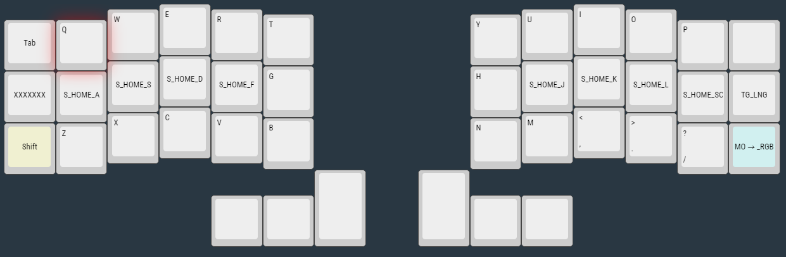
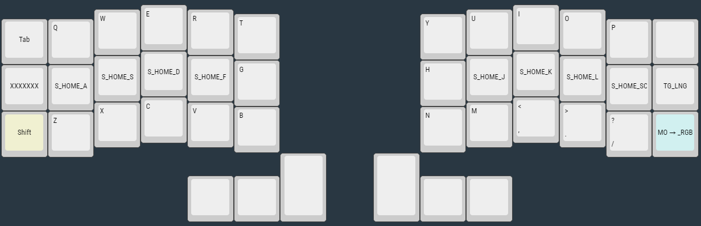

# CRKBD 3x6 Custom keymap for Korean

Refer to Miryoku Layout (COLEMAK-DH)  
  

BASE Layer - COLEMAKDH  


SET2 Layer - QWERTY  


[home_row_mods_tutorial](https://precondition.github.io/home-row-mods)  
GCAS mod
```c
// Left-hand home row mods
#define HOME_A LGUI_T(KC_A)
#define HOME_R LCTL_T(KC_R)
#define HOME_S LALT_T(KC_S)
#define HOME_T LSFT_T(KC_T)

// Right-hand home row mods
#define HOME_N RSFT_T(KC_N)
#define HOME_E RALT_T(KC_E)
#define HOME_I RCTL_T(KC_I)
#define HOME_O RGUI_T(KC_O)
//
```

QWERTY레이어(SET2)를 올리고 한영키 입력, 재입력시 Base Layer로 돌아옴
```c
//Macro
enum custom_keycodes {
    TG_LNG,  //SET2로 전환 및 한영키 실행
};
```

Make example for this keyboard (after setting up your build environment):
```sh
 qmk flash -kb crkbd/rev1 -km custom36
```

See the [build environment setup](https://docs.qmk.fm/#/getting_started_build_tools) and the [make instructions](https://docs.qmk.fm/#/getting_started_make_guide) for more information. Brand new to QMK? Start with our [Complete Newbs Guide](https://docs.qmk.fm/#/newbs).
<br>

### 한영 전환시 이슈
- 한글과 영어 레이어가 달라서 한영 각각의 레이어 상태를 동기화해야 함
- OS단의 한/영 상태를 받아올 방법이 없음
<br>
  
### 해결 방법
윈도우
- 오토핫키 사용
- 날개셋 ([링크](http://moogi.new21.org/prg4.html))
- 윈도우 입력기를 두개로 구성해서 입력기 전환 단축키 설정  

맥
- 해머스푼 : 전환 단축키를 두 개 만듬
<br>
-------------------------------
qmk `1.1.5`
